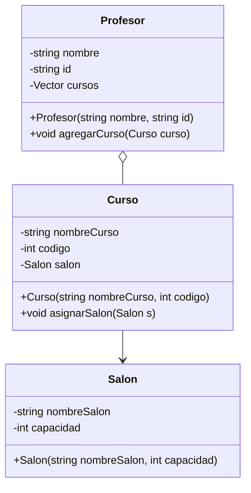

## Ejemplo

Implementación de un ejercicio de codificación orientada a objetos que representa el siguiente diseño

```mermaid
classDiagram
    class Profesor {
        -string nombre
        -string id
        -Vector cursos
        +Profesor(string nombre, string id)
        +void agregarCurso(Curso curso)
    }

    class Curso {
        -string nombreCurso
        -int codigo
        -Salon salon
        +Curso(string nombreCurso, int codigo)
        +void asignarSalon(Salon s)
    }

    class Salon {
        -string nombreSalon
        -int capacidad

        +Salon(string nombreSalon, int capacidad)
    }

    Profesor o-- Curso 
    Curso --> Salon 
```